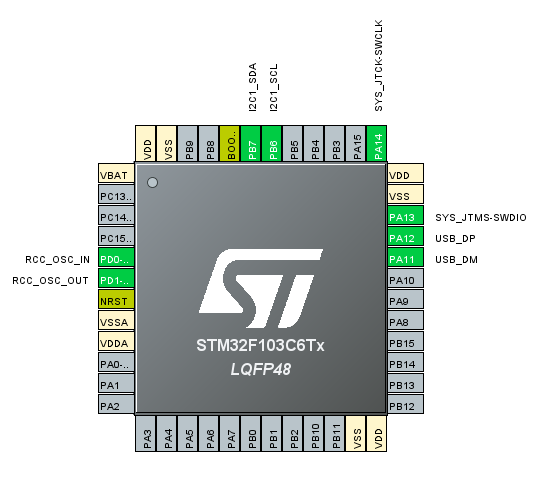

# STM32_WEBCAM_FACE_DETECTION_OLED
Face detection using a webcam with STM32 (STM32F103C6T6A)-based OLED alert system. Python script detects face using OpenCV and communicates with STM32 over serial to display status on OLED.

# STM32 Face Detection Alert System with OLED Display

This project demonstrates an embedded system application using the **STM32F103C6T6A** microcontroller, where **real-time face detection** is handled on a PC via Python and OpenCV. If no human face is detected, the STM32 receives a signal and displays an alert message on an **I2C OLED display**.

> 🔧 Embedded + Python + Real-time Communication

---

## 🎯 Project Highlights

- 🔍 **Face Detection** using OpenCV in Python
- 🧠 **Decision Making** on PC side, embedded response on STM32
- 📟 **OLED Display** (I2C) to show alerts
- 🔗 **UART Communication** between Python script and STM32
- 💡 implemented in **STM32CubeIDE**

---

## 🧰 Tech Stack

| Component       | Tool/Language                                    |
|---------------- |--------------------------------------------------|
| Microcontroller | STM32F103C6T6A (Blue Pill)                       |
| Display         | 0.96" OLED (I2C)                                 |
| Detection       | Python + OpenCV                                  |
| IDE             | STM32CubeIDE                                     |                               
| Code Generator  | STM32CubeIDE                                     |
| Communication   | UART-based serial communication (via USB cable)  |

## 🎥 Demo

▶️ [Watch Demo on Google Drive](https://drive.google.com/file/d/1XgHL1JgC6b6LPkRL8yUgNNtOnD6Kbw3e/view?usp=sharing)

You can also download the full project with code and configs:
📦 [Download ZIP](./STM32_OLED_FACE_DETECTION.zip)

---

## 📌 Pin Configuration

---

## 👩‍💻 Author

**Saranya**  
B.Tech – Electronics and Communication Engineering  
SASTRA Deemed University  
[GitHub Portfolio](https://github.com/Saranya-T-S)  

---

## 📄 License
This project is shared for academic, learning, and demo purposes.
